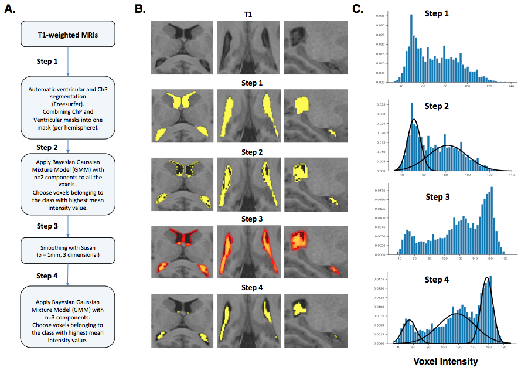
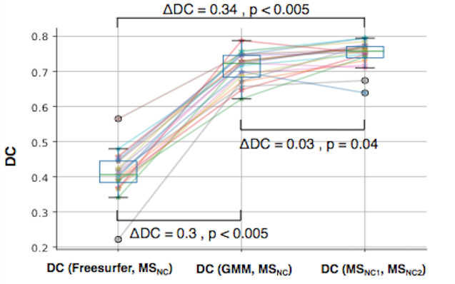
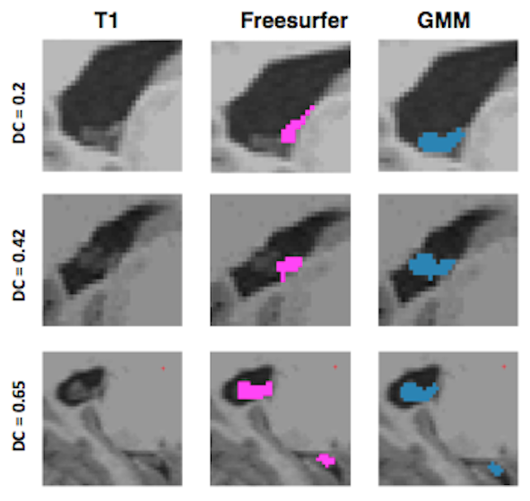

# Choroid plexus segmentation using Gaussian Mixture Models (GMM)

Studies of choroid plexus have recently gained attention. Given its role in CSF production, choroid plexus plays a crucial role in CSF-based clearance systems. Moreover, choroid plexus epithelium is lined with numerous transporters that transport various CSF proteins including Aβ to the blood. T1-weighted MRIs provide a non-invasive imaging technique to study the morphological characteristics of choroid plexus and also enable more advanced functional and perfusion imaging, given their abilitiy to segment choroid plexus accurately. Previous studies have used Freesurfer for automatic choroid plexus segmentation. Here, we present a lightweight algorithm that aims to improve choroid plexus segmentation using Gaussian Mixture Models (GMM). We tested the accuracy of the algorithm against manual segmentations as well as Freesurfer. 

Our paper describing this lightweight algorithm with potential implications for multi-modal neuroimaging studies of choroid plexus in dementia has been accepted for publication in the <b><i>Journal of Alzheimer's Disease (JAD)</b></i>. 
 
<h3>Pipeline</h3>



<h3>Comparing GMM and Freesurfer against Manual Segmentation (MS) in 20 subjects of Human Connectome Project (HCP) dataset</h3>

<b>MS<sub>NC</sub>:</b> Manual Segmentation usign T1-weighted MRIs with No Contrast<br>
<b>MS<sub>NC1/2</sub>:</b> MS performed by researcher 1 or 2<br>
<b>Dice Coefficient (DC):</b> A metric that calculates spatial similarity between two segmentations

<h3>Choroid plexus segmentation for three representative subjects of HCP dataset using Freesurfer and GMM</h3> 
 

<h3> Required packages</h3>

* FSL
* Freesurfer
* Python: nibabel, sklearn, numpy 

<h3> How to run the code</h3>
The current version of the script requires Freesurfer processed files (recon-all) for ventricular segmentation. In future, we aim to add the possibility to use other ventricular segmetnation algorithms to speed up the process. After running recon-all, you can get the choroid plexus segmentation as follows: 

In the terminal:
```bash
python run_gmm_chp_segmentation.py <freesurfer_subjects_dir> <subject_id>
```
The resulting choroid plexus segmentation can be found under `<freesurfer_subjects_dir><subject_id>mri/choroid_susan_segmentation.nii.gz`

<h3>Contact</h3>
For further questions, please email me at <a href="mailto:stadayon@bidmc.harvard.edu">stadayon@bidmc.harvard.edu</a> or <a href="mailto:sunny.tadayon@gmail.com">sunny.tadayon@gmail.com</a>. 


