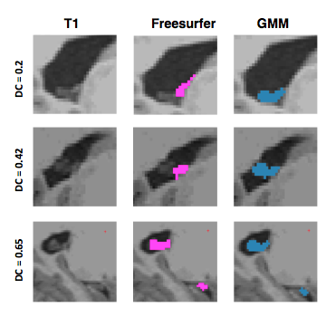

# Choroid plexus segmentation using Gaussian Mixture Models

 Studies of choroid plexus have recently gained momentum, given its role in CSF production as well as CSF clearance. T1-weighted MRIs provide a non-invasive imaging technique to study the morphological characteristics of choroid plexus and also enable more advanced functional and perfusion imaging given their abilitiy to segment choroid plexus accurately. Previous studies have used Freesurfer for automatic choroid plexus segmentation. Here, we present present a lightweight algorithm that aims to improve choroid plexus segmentation using Gaussian Mixture Models. We tested the accuracy of the algorithm against manual segmentations as well as Freesurfer. Our paper has been accepted for publication in Journal of Alzheimer's Disease (JAD). 
 

